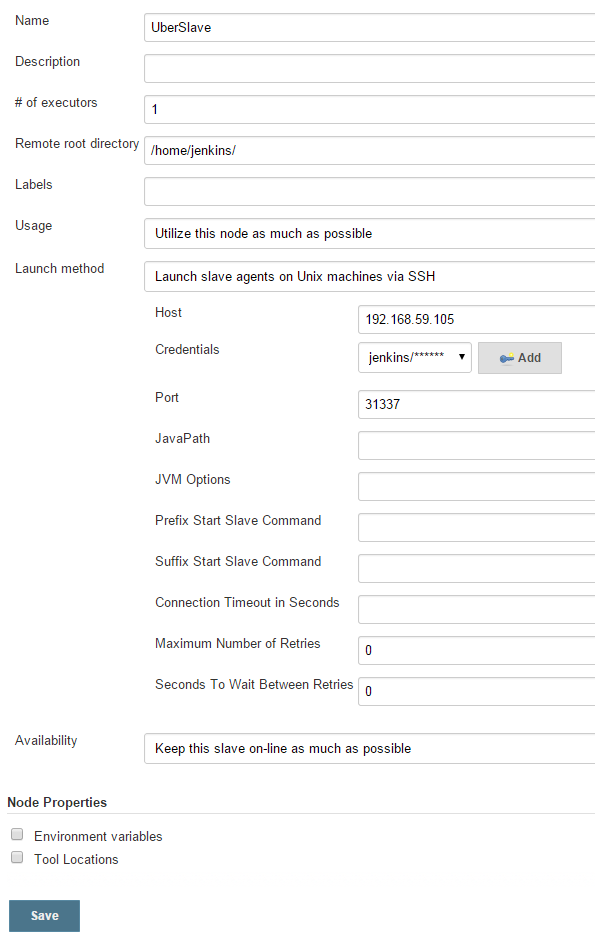

#Jenkins-slave-container

## Bygg
```sh
$ docker build -t jenkins_agent <path til docker file>
```

## Kjør med eksponert port
```sh
$ docker run -d -P -p 31337:22 jenkins_agent
```

## Kjør uten eksponert port om du vil linke containere
```sh
$ docker run -d --name jenkings_agent jenkins_agent
```
Denne kan da linkes inn i andre containere med argumentet link.
```sh
--link <name or id>:alias
```
For eksempel:
```sh
$ docker run -d -P --name jenkins_master --link jenkins_agent:jenkins_agent <someId>
```
Hosts fila vil da bli oppdatert med jenkins_agent pekende til ipen til den linka containeren. 

## Legge til slave
For å legge til en agent i jenkins, åpne webgrensesnittet i nettleseren din. Og gjør følgende.

1. Velg Manage Jenkins
2. Velg Manage Nodes
3. Velg New Node
4. Velg Dumb Slave og gi den et navn, f.eks UberSlave
5. Klikk på OK.
6. Legg inn /home/jenkins/ i Remote root directory. Det er dette som ble valgt som home directory for brukeren jenkins i image.
7. Legg inn ipen hvor docker kjører i Host. Om du kjører linked containers så er dette navnet du brukte ved linking.
8. Klikk Add siden av Credentials
9. Legg inn username/password jenkins/jenkins i dette tilfellet.
10. Klikk add.
11. Velg Advanced...
12. Endre port til porten som eksponerer ssh mot slave-image i docker.
13. Klikk save.

